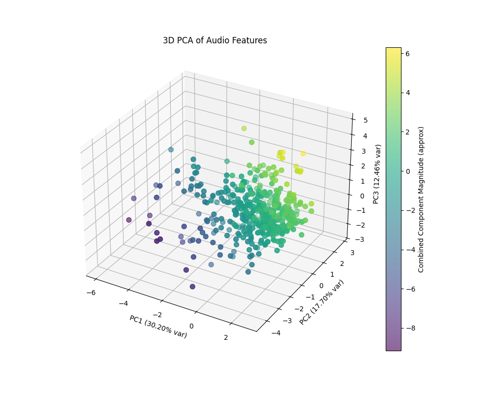

# Chancla Mix Telescope 🔭

A data analysis and visualization dashboard for the "Chancla Mix" Spotify playlist. This tool explores the musical landscape of the playlist using 3D Principal Component Analysis (PCA) on track audio features.



## 🌟 Features

- **3D Musical Landscape**: Visualize songs in a 3D space based on their intrinsic audio characteristics (Energy, Danceability, BPM, etc.).
- **Contributor Analysis**: Filter by contributor to see their specific "musical footprint."
- **Interactive Statistics**:
  - **Bridge songs**: Find the common ground between different contributors.
  - **Taste Diversity**: Rankings of who has the most diverse vs. consistent music picks.
  - **Underground Ranking**: See who discovers the most "hidden gems" based on average popularity.
  - **Similarity Scores**: Compare how similar your music taste is to others.
- **Dynamic Evolution**: Generate a 3D animation showing how the playlist has changed over time.
- **Dark/Light Mode**: Sleek UI with modern aesthetics.

## 🚀 Quick Start

### Prerequisites

- Python 3.13 or higher
- [FFmpeg](https://ffmpeg.org/) (optional, required if you want to generate the 3D evolution video)

### Installation

It is highly recommended to use [uv](https://github.com/astral-sh/uv) for fast and reliable dependency management.

1. **Clone the repository**:
   ```bash
   git clone <repository-url>
   cd chancla-mix-analysis
   ```

2. **Set up the environment and install packages**:
   If you have `uv` installed:
   ```bash
   uv sync
   ```
   This will automatically create a virtual environment in `.venv` and install all required dependencies from `pyproject.toml`.

   **Alternatively (Manual/Pip way)**:
   ```bash
   python -m venv .venv
   source .venv/bin/activate  # On Windows: .venv\Scripts\activate
   pip install -r requirements.txt
   ```

## ⚙️ Configuration

Create a `.env` file in the root directory with your Spotify API credentials and the Playlist ID (NOTE: This is only necessary if you want to run the `organize_data.py` script. Otherwise, you can skip this step.):

```env
SPOTIFY_CLIENT_ID='your_client_id'
SPOTIFY_CLIENT_SECRET='your_client_secret'
SPOTIFY_PLAYLIST_ID='your_playlist_id'
```

## 🛠️ Usage

### 1. Data Preparation
First, sync the latest contributor data from Spotify and merge it with the audio features:
```bash
python organize_data.py
```

### 2. PCA Analysis
Run the dimensionality reduction script to calculate the 3D coordinates for each song:
```bash
python pca_analysis.py
```

### 3. Launch the Dashboard
Start the interactive dashboard:
```bash
python app.py
```
Open `http://127.0.0.1:8050` in your browser.

### 4. Optional: Evolution Video
To generate a 3D animation of the playlist evolution:
```bash
python visualize_evolution.py
```

## 📁 File Structure

- `app.py`: The main Dash application (Frontend & Interactivity).
- `pca_analysis.py`: Performs PCA on audio features and generates coordinates.
- `organize_data.py`: Fetches contributor info from Spotify API and organizes CSV data.
- `visualize_evolution.py`: Generates a `.mp4` video of the musical landscape evolution.
- `remove_duplicates.py`: Utility to clean the dataset.
- `assets/`: Folder containing images, icons, and custom CSS.
- `data_new.csv`: The cleaned dataset with all metadata and features.
- `pca_results.csv`: The final data used by the dashboard (PCA coordinates + metadata).

---